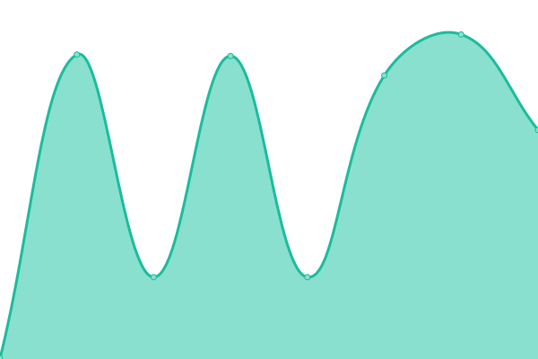
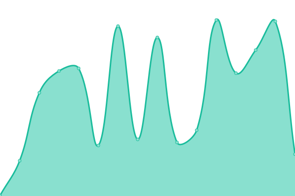

# [📈 Live Status](https://yanyao2333.github.io/upptime): <!--live status--> **🟩 All systems operational**

This repository contains the open-source uptime monitor and status page for [Roitium.](https://yanyao2333.github.io/upptime), powered by [Upptime](https://github.com/upptime/upptime).

With [Upptime](https://upptime.js.org), you can get your own unlimited and free uptime monitor and status page, powered entirely by a GitHub repository. We use [Issues](https://github.com/yanyao2333/upptime/issues) as incident reports, [Actions](https://github.com/yanyao2333/upptime/actions) as uptime monitors, and [Pages](https://yanyao2333.github.io/upptime) for the status page.

<!--start: status pages-->
<!-- This summary is generated by Upptime (https://github.com/upptime/upptime) -->
<!-- Do not edit this manually, your changes will be overwritten -->
<!-- prettier-ignore -->
| URL | Status | History | Response Time | Uptime |
| --- | ------ | ------- | ------------- | ------ |
|  [Blog](https://www.roitium.com) | 🟩 Up | [blog.yml](https://github.com/yanyao2333/upptime/commits/HEAD/history/blog.yml) | 

 1117ms
     
 | 

<a href="https://yanyao2333.github.io/upptime/history/blog">100.00%</a>
    

|  [Self-hosted Bitwarden](https://passwd.roitium.com) | 🟩 Up | [self-hosted-bitwarden.yml](https://github.com/yanyao2333/upptime/commits/HEAD/history/self-hosted-bitwarden.yml) | 

 286ms
     
 | 

<a href="https://yanyao2333.github.io/upptime/history/self-hosted-bitwarden">100.00%</a>
    

|  [Self-hosted FreshRSS](https://rss.roitium.com) | 🟩 Up | [self-hosted-fresh-rss.yml](https://github.com/yanyao2333/upptime/commits/HEAD/history/self-hosted-fresh-rss.yml) | 

 338ms
     
 | 

<a href="https://yanyao2333.github.io/upptime/history/self-hosted-fresh-rss">99.71%</a>
    

|  [Self-hosted Memos](https://memos.roitium.com) | 🟩 Up | [self-hosted-memos.yml](https://github.com/yanyao2333/upptime/commits/HEAD/history/self-hosted-memos.yml) | 

 1481ms
     
 | 

<a href="https://yanyao2333.github.io/upptime/history/self-hosted-memos">99.82%</a>
    

<!--end: status pages-->

[**Visit our status website →**](https://yanyao2333.github.io/upptime)

## 📄 License

- Powered by: [Upptime](https://github.com/upptime/upptime)
- Code: [MIT](./LICENSE) © [Anand Chowdhary](https://anandchowdhary.com), supported by [Pabio](https://pabio.com)
- Data in the `./history` directory: [Open Database License](https://opendatacommons.org/licenses/odbl/1-0/)
